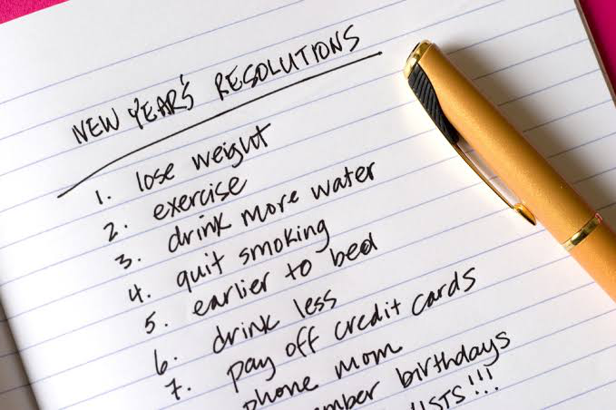
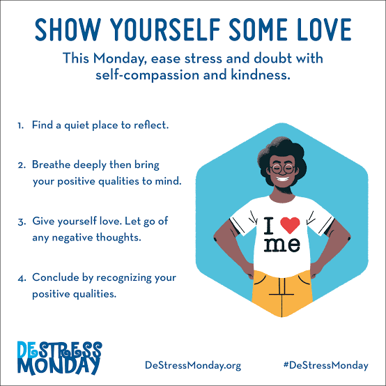
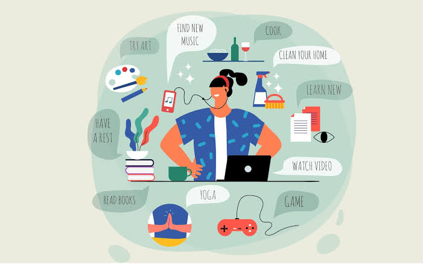
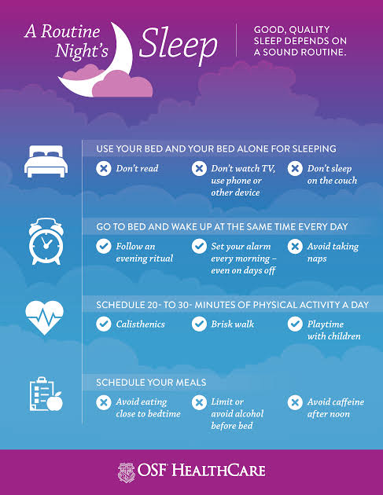
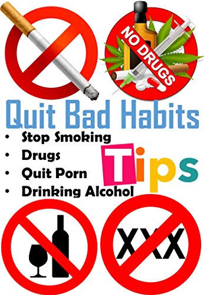

An important part of keeping fit and healthy is to take care of your own mental health. There are plenty of things you can do to help make sure you keep yourself mentally healthy.

## Step 1 Skip the big new year's resolution

"Be gentle with you resolutions this year", advised Angela Drake, a clinical neuropsychologist in the Department of Psychiatric and Behavior Sciences at UC Davis Health. "Set small realistic goals and reward yourself for small wins or changes." Two examples : Find one positive thing each day to focus on or make time for a five-minutes silence break every day - and get the kids in on it, if you can.

## Step 2 Try to give others the benefit of the doubt

It's easy to get angry and frustrated, especially when we're already dealing with anxiety and pressure related to the pandemic or its accompany economic struggles. But that can add to our own unhappiness, said Suo, "Remember that everyone's fuses are shorter". Maybe that person who just invaded your space or yelled at worker just found out a relative died, or lost their job , or their kid is failing sixth grade", she said "Try to be kind when yo can, keep your distance and don't judge others too harshly. People are better than we give them credit for. "

## Step 3 Be kind to yourself

> Whether it's video streaming, podcast, reading, outdoors activities, board games, video games, hobbies, chatting, with friends, for hours - if it brings you joy, that's what you should do in, moderation, of course - Shannon Suo

it sounds simple, but its one of the toughest thing to master. 

> Acknowledge that this is a difficult time. Not being hard on yourself is so important right now - Drake said
>
> Dont beat yourself up for the weight you may have gained, due to lack of exercise, or the dust bunnies around the bed. Self-care is important and essential to feeling recharged 

## Step 4 Small steps make a big difference - literally

Exercise is not only good for our physical health, it can have a profound, positive impact on our mental health, too. 

> Focus on moderate exercise that you can do consistently. No need to train for marathon, but maybe commit to being able to walk or run a 5k or even a 10k, and slowly build it up ti that  - Suo said.

Make a commitment to moving more and to balancing that with good food choices and the occasional indulgence. Find a type of exercise that you enjoy and start small. This short video from sports medicine program includes several great ideas for squeezing exercise into your day, even while working from home . The Centers for Disease control and prevention (CDC) recommends 150 minutes of physical exercise weekly for greatest health benefits. 

> Calculate how much exercise you get each week now and set a goal to add 5-10 minutes per week if you are short. You can use a fitness tracking app to log your activity, so you know when you reach your goal

## Step 5 Explore meditation, art or other calming activities

> Mindfulness meditation can be great for many people, but some patients refer other methods - Drake said

There are many forms of meditation - including one specifically for fidgety folks - so be open to different strategies until you find what  it works for you! I know of one patient who found painting very calming - it even helped ease her chronic pain

> Meditation works great for some people and would probably benefit most if they took the time to do it - Suo said

There are lots of apps that can help, including this free one from UCLA. Suo also recommend scheduling regular virtual meetings with friends or family members - and post-pandemic, regular walks or coffee dates. If you schedule it in regularly, you'are more likely to do it.

## Step 6 Focus on the Joy

When we are grieving the loss of normalcy - of play dates, dinner out, movies in a theater, large family gathering and much more - it helps to find other things that bring us real happiness. 

> Whether it's video streaming, podcasts, reading, outdoor, activities, boards, video games, hobbies, chatting with friends for hours - if it brings you joy, that's what you should do in moderation, of course - Suo said

I am a firm believer in the restorative power of baking. Drake shared. Try to focus on the fun activities that are available to you, rather than the ones that aren't that mind shift can do wonders

## Step 7 Rediscover a hobby

> Don't beat yourself up for the weight you may have gained, due to lack of exercise, or the dust bunnies around the bed. Self-care is important and essential to feeling recharged - Angela Drake

Channeling time and energy into a new - or newly rediscovered - hobby can be an effective way to improve your outlook. "I have used almost everything in my craft room, including the carefully curated things I've bought over the years but never had the time to figure out how to use!" laughed Suo. She says she;s used all the supplies to make decorations and homemade gifts for loved ones. "I love seeing and hearing people's reactions to what I've selected or made for them, so it brings new decorations around our house" - Suo said

## Step 8 putting things off.

"2020 has taught us an important Buddhistic lesson in impermanence" - Suo explained. "Stop putting things off. if there's something you've always wanted to do but kept putting off, do it in 2021 - once it's safe to do so, if it involves travel or being with other people, of course". Making plans can help, too, as it gives us something to look forward to. so while it's not yet a good time to take that international trip you've always dreamed of, you could start researching and planning it bout the little things you've been wanting to do - learn to bake bread, reach out to an old friend, learn calligraphy or start a journal - whatever you've been putting off.

## Step 9 Do what you cant to sleep better

"Insomnia is a major problem for many adults, and I have even seen kids struggle with sleep" Dake said. Sleep is essential to health and is influenced by stress - but also activity levels. Staying inside at home has made many of us less active. increasing your activity level is a good start, and light therapy can also help to reset your internal clock. Check out these tips for fighting *"coronasomna"*

## Step 10 Don't put off seeking help

This is most important of all. Seek help if you are struggling. Telehealth appointments are safe and can be very effective. "We have evidence that the increased isolation of the panemic is leading to more people using substances and delaying" Seeking help - Suo said "Don't delay. There is hope and there are professionals who can help you through this"

## Step 11 Eat well

Eating well isn't just important for our bodies, but its also important for our minds. Certain mineral deficiencies, such as iron and vitamin B12 deficiences, can give us a low mood. Try to eat a balanced diet. If you find you're a  particularly stressed or anxious person, you should try limiting or cutting our caffeine as this can make you feel jittery and anxious

## Step 12 Get Plenty of Sunlight

Sunlight is a great source of vitamin D. Vitamin D is a really important vitamin for ou bodies and our brains. It helps our brains to release chemicals which improve our mood, like endorphins and serotonin. Try to go out in the sun when you can, but make sure you keep your skin and eyes safe. 30 minutes to two hours a day of sunlight is ideal. During the winter, some people become depressed because they aren't getting enough sunlight - this is known as seasonal affective Disorder (SAD). Some people find using a secial light-therapy lamp helps to alleviate the symptoms

## Step 13 Connect with others and be sociable

Make an effort to maintain good relationships and talk to people whenever you get the chance. Having friends is important not just for your self-esteem, but also for providing support when you're not feeling too great. Research has found that talking to others for just ten minutes can improve memory and test scores! Whether or not you find going out and meeting people difficult you can have a look at our Social Activities pages or our events calendar for inspiration.

## Step 14 Avoid alcohol, smoking and drugs

Drinking and smoking aren't things which we always associate with withdrawal symptoms, but they can cause some which impact on your mental health. When you've had a few drinks you can feel more depressed and anxious the next day, and it can be harder to concentrate. Excessive drinking for prolonged periods can leave you with a thiamine deficiency. Thiamine is important for our brain function and a deficiency can lead to severe memory problems, motor (coordination) problems, confusion and eye problems. If you smoke, between cigarettes your body and brain go into withdrawal which makes you irritable and anxious

Other drugs will often leave you in withdrawal and can often cause very low moods and anxiety. More sever effects of drugs include paranoia and delusions. There is some research that suggests drug use is related to developing mental disorder like schizophrenia

Have a look at our pages on help to stop smoking and on alcohol and substances use for more information

## Step 15 Do things for others

Helping others isn't just good for the people you're helping; it's good for you too. Helping someone can help with your self-esteem and make you feel good about your place in the world. Feeling as though you;re part of a community is a really important part of your mental health. You could try volunteering for a local charity, or just being neighbourly.

## Step 16 improve you work-life balance

We all have many roles in life. you might be a parent, a partner, an employee, a student, a church member, a teammate, a carer or a volunteer. It is easy to feel pulled between responsibilities and it can be tempting to sacrifice important parts of your life. This can leave you less satisfied and more stressed. Researchers suggested working towards greater balance fosters well being

Think about how satisfied you are with the different areas of your life: relationships, work, recreation, health, exercise, self-development, and spiritual life. Are you devoting the amount of attention you would like to each? Making more time for some, and putting boundaries around others, might help create that balance.

Taking time to wind down and enjoy relaxing activities is an important part of a balanced life and helps to reduce stress. Relaxing activities, such as gardening or reading, listening to music, walking or singing, should be an important part of your routine

## Step 17 Laugh loud, laugh often

Laughter really is good medicine. Humour that expresses positive emotion and messages (rather than humour that puts yourself or other people down), is good for your mental health. It has been found to release 'feel good' hormones, increase optimism, improve your mood over time and improve relationships by increasing connection and intimacy.

## Step 18 Limit media & technology use

Try reducing your amount of technology use and media consumption on daily basis

You might not consider yourself addicted to social media or your smartphone and other devices, but it is often much more difficult to limit or reduce media consumption and technology use than you'd expect. The impacts of excessive and prolonged social media consumption can be harmful. Even over-consumption of news can negatively impact your mental well being. There's no need to cut it out completely from your life and go cold turkey. But try limiting when or how you use it. Here are some specific pieces of advices to help you with this tip :

> \- Keep your phone out of your bedroom so it''s not the last thing you check before going to sleep or the first thing you look at in the morning
>
> \- Don't use your phone half an hour before bed or for the first half an hour from walking
>
> \- Put your phone down on another table during meal times where  you can't reach it
>
> \- Try challenging yourself by going a whole day without checking social media

## Step 19 Volunteer

The meaning and purpose derived from helping others or the community can enrich and expand your life - and make you happier. There's no limit to the individual and group volunteer opportunities you can explore. Schools, places of worship, nonprofits, and charitable organizations of all sorts **depend on volunteers for help in any capacity**

## Step 20 Get help from a licensed mental health professional when an if you need it.

Seeking help is a sign of strength - not a weakness. Just as it requires effort to build and maintain physical health, so it is with mental health.

This list included a few small but impactful ways to improve your mental health every day. it is most important to remember that treatment is effective. People who get appropriate care can recover from mental illness and lead full, productive, and rewarding lives.

*References:*

<https://health.ucdavis.edu/health-news/newsroom/caring-for-your-mental-health-in-2021-10-tips/2021/01>

<https://www.peoplefirstinfo.org.uk/health-and-well-being/mental-health/10-top-tips-for-good-mental-health/>

<https://psychlopaedia.org/top-tips/10-ways-to-help-your-mental-health/>

<https://www.onecentralhealth.com.au/mental-health/10-tips-for-improving-your-mental-health/>

<https://www.bbrfoundation.org/blog/everyday-mental-health-tips>