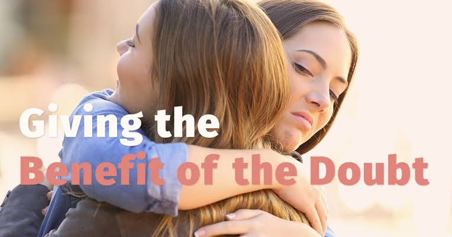

An important part of keeping fit and healthy is to take care of your own mental health. There are plenty of things you can do to help make sure you keep yourself mentally healthy.

## Step 1 Skip the big new year's resolution

"Be gentle with you resolutions this year", advised Angela Drake, a clinical neuropsychologist in the Department of Psychiatric and Behavior Sciences at UC Davis Health. "Set small realistic goals and reward yourself for small wins or changes." Two examples : Find one positive thing each day to focus on or make time for a five-minutes silence break every day - and get the kids in on it, if you can.

## Step 2 Try to give others the benefit of the doubt

It's easy to get angry and frustrated, especially when we're already dealing with anxiety and pressure related to the pandemic or its accompany economic struggles. But that can add to our own unhappiness, said Suo, "Remember that everyone's fuses are shorter". Maybe that person who just invaded your space or yelled at worker just found out a relative died, or lost their job , or their kid is failing sixth grade", she said "Try to be kind when yo can, keep your distance and don't judge others too harshly. People are better than we give them credit for. "

## Step 3 Be kind to yourself

> Whether it's video streaming, podcast, reading, outdoors activities, board games, video games, hobbies, chatting, with friends, for hours - if it brings you joy, that's what you should do in, moderation, of course - Shannon Suo

it sounds simple, but its one of the toughest thing to master. 

> Acknowledge that this is a difficult time. Not being hard on yourself is so important right now - Drake said
>
> Dont beat yourself up for the weight you may have gained, due to lack of exercise, or the dust bunnies around the bed. Self-care is important and essential to feeling recharged 

## Step 4 Small steps make a big difference - literally

Exercise is not only good for our physical health, it can have a profound, positive impact on our mental health, too. 

> Focus on moderate exercise that you can do consistently. No need to train for marathon, but maybe commit to being able to walk or run a 5k or even a 10k, and slowly build it up ti that  - Suo said.

Make a commitment to moving more and to balancing that with good food choices and the occasional indulgence. Find a type of exercise that you enjoy and start small. This short video from sports medicine program includes several great ideas for squeezing exercise into your day, even while working from home . The Centers for Disease control and prevention (CDC) recommends 150 minutes of physical exercise weekly for greatest health benefits. 

> Calculate how much exercise you get each week now and set a goal to add 5-10 minutes per week if you are short. You can use a fitness tracking app to log your activity, so you know when you reach your goal

## Step 5 Explore meditation, art or other calming activities

> Mindfulness meditation can be great for many people, but some patients refer other methods - Drake said

There are many forms of meditation - including one specifically for fidgety folks - so be open to different strategies until you find what  it works for you! I know of one patient who found painting very calming - it even helped ease her chronic pain

> Meditation works great for some people and would probably benefit most if they took the time to do it - Suo said

There are lots of apps that can help, including this free one from UCLA. Suo also recommend